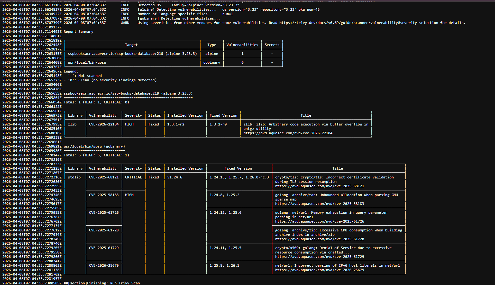
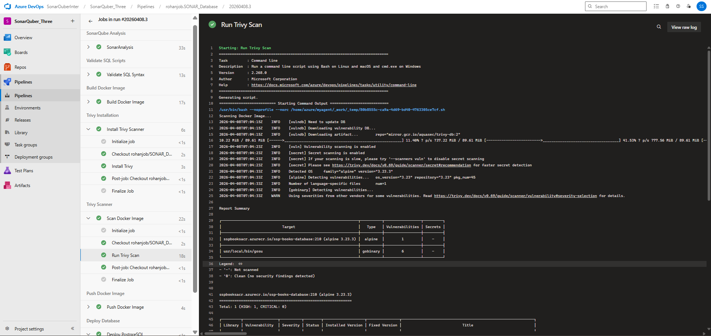

# 🗄️ SSP Books - Database Layer

PostgreSQL database for the SSP Books course buying platform.


###🚀Implemention Images(Azure DevOps ,SonarQube  &&  Trivy cI)

## 🚀🚀SonarQube

## 🚀🚀🚀Trivy CI




## 📋 Schema Overview

| Table | Description |
|-------|-------------|
| `users` | User accounts and profiles |
| `categories` | Course categories |
| `courses` | Course catalog with pricing |
| `orders` | Purchase orders |
| `order_items` | Individual items in orders |
| `cart_items` | Shopping cart items |
| `reviews` | Course reviews and ratings |
| `enrollments` | User course enrollments |

## 🚀 Quick Start

### Using Docker Compose
```bash
docker-compose up -d
```

### Manual Setup
```bash
# Create database
createdb ssp_books

# Run schema
psql -U postgres -d ssp_books -f init.sql

# Seed data
psql -U postgres -d ssp_books -f seed.sql
```

## 🔧 Configuration

| Variable | Default | Description |
|----------|---------|-------------|
| `POSTGRES_DB` | `ssp_books` | Database name |
| `POSTGRES_USER` | `ssp_admin` | Database user |
| `POSTGRES_PASSWORD` | `sspbooks2026` | Database password |

## 🔄 CI/CD

The project utilizes Azure DevOps for its automated CI/CD pipeline (`azure-pipelines.yml`), which includes security and code-quality scanning. The sequence is as follows:

1. **Stage 1 (Code Quality)**: Reviews SQL metadata via `sonar-project.properties`.
2. **Stage 2 (Validate)**: Spins up a test PostgreSQL container to dry-run `init.sql` and `seed.sql`.
3. **Stage 3 (Build)**: Builds the final `ssp-books-database` Docker image.
4. **Stage 4 (Trivy Install)**: Installs the Aquasecurity Trivy scanner into the CI runner.
5. **Stage 5 (Trivy Scanner)**: Audits the built Docker container specifically for HIGH and CRITICAL vulnerabilities.
6. **Stage 6 (Push)**: Publishes the validated and secure database image to Azure Container Registry.
7. **Stage 7 (Deploy)**: Executes final database updates or migrations to the Production environment.
